# 📅 Calendar Agent: Your AI-Powered Work-Life Navigator

```mermaid
graph LR
    User(["👤 User"]) <-->|"Natural Language\nRequests & Responses"| Claude["🧠 Claude AI\n(Assistant)"]
    Claude <-->|"MCP Integration"| MCP["⚙️ Model Context\nProtocol (MCP)"]
    MCP <-->|"API Calls"| Calendar["📅 Google Calendar"]

    subgraph "Calendar Agent System"
        Claude
        MCP
    end

    subgraph "Organized Schedule"
        Calendar --> MAIN["🏢 MAIN Projects\n(Primary Job)"]
        Calendar --> SIDE["💼 SIDE Projects\n(Side Jobs)"]
        Calendar --> PORT["🌟 PORT Projects\n(Portfolio)"]
        Calendar --> BREAK["☕ Breaks &\nLunch"]
    end

    style User fill:#f9f9f9,stroke:#333,stroke-width:2px
    style Claude fill:#5C4EE5,color:#fff,stroke:#333,stroke-width:2px
    style MCP fill:#4CAF50,color:#fff,stroke:#333,stroke-width:2px
    style Calendar fill:#4285F4,color:#fff,stroke:#333,stroke-width:2px
    style MAIN fill:#DB4437,color:#fff,stroke:#333,stroke-width:1px
    style SIDE fill:#F4B400,color:#fff,stroke:#333,stroke-width:1px
    style PORT fill:#0F9D58,color:#fff,stroke:#333,stroke-width:1px
    style BREAK fill:#9E9E9E,color:#fff,stroke:#333,stroke-width:1px
```



## The Story Behind Calendar Agent

In the chaos of modern work life, I found myself juggling multiple responsibilities: a demanding main job, exciting side projects, and the constant need to build my portfolio. My calendar became a battlefield of competing priorities, and I often felt like I was letting important tasks slip through the cracks.

That's when I envisioned the Calendar Agent—a system that would not just track my commitments but actively help me navigate them. By leveraging the power of Model Context Protocol (MCP), I created an AI-powered assistant that could understand my work patterns, help me schedule effectively, and maintain the boundaries between different areas of my professional life.

## What is MCP and How It Powers This Project

The Model Context Protocol (MCP) is the secret ingredient that makes this system truly intelligent. Unlike traditional calendar integrations that simply execute commands, MCP creates a two-way communication channel between AI assistants (like Claude) and your Google Calendar.

With MCP, your AI assistant can:

- Directly access your calendar data without you having to copy/paste information
- Create, modify, and delete events with natural language instructions
- Understand the context of your schedule to make intelligent suggestions
- Maintain privacy through anonymized project references

This repository demonstrates the power of MCP by creating a comprehensive work schedule management system that feels like having a personal assistant who understands your professional life.

## A Day in the Life with Calendar Agent

Imagine starting your day with a simple conversation:

> "Good morning, Calendar Agent. What's on my schedule today?"

Your AI assistant, powered by MCP, responds with a complete overview of your day, including:

- Your main job tasks (coded as MAIN-01, MAIN-02, etc. for privacy)
- Time blocks for your side projects (SIDE-01, SIDE-02)
- Scheduled work on portfolio items (PORT-01)
- Breaks and lunch periods optimized for your productivity

When a meeting runs long or you need to adjust your schedule:

> "I need to reschedule my work on the SIDE-01 project due to an extended client meeting."

The Calendar Agent understands the context, accesses your calendar through MCP, and suggests optimal alternatives based on your productivity patterns and existing commitments.

## Repository Structure

This repository contains everything you need to implement your own AI-powered Calendar Agent:

- **[google_calendar_agent_guide.md](docs/google_calendar_agent_guide.md)**: The comprehensive guide explaining the philosophy and implementation details of the system.

- **[log_index.md](docs/log_index.md)**: A master index of all project activities, serving as the central reference for your journey.

- **[logs/](logs/)**: Directory containing the story of your work, captured in detailed log files.

  - Example: [logs/MAIN-01-20250314.md](logs/MAIN-01-20250314.md)

- **[calendar_integration_example.js](src/calendar_integration_example.js)**: Example JavaScript code demonstrating the MCP-powered Google Calendar integration.

- **[mcp_calendar_commands.md](docs/mcp_calendar_commands.md)**: Your guide to communicating with Google Calendar through MCP.

- **[example_prompts.md](docs/example_prompts.md)**: Bilingual examples (Korean and English) for natural conversations with your Calendar Agent.

## The MCP Advantage

What makes this system different from traditional calendar tools is the deep integration with MCP. When you interact with your Calendar Agent:

1. Your request is processed by an AI assistant (like Claude)
2. The assistant uses MCP tools to directly access your Google Calendar
3. Calendar data is retrieved and analyzed in real-time
4. The assistant makes intelligent suggestions based on your schedule patterns
5. Changes are implemented directly through the MCP connection
6. All interactions are logged for future reference and improvement

This seamless flow creates an experience that feels like having a human assistant who knows your schedule inside and out.

## Getting Started on Your Journey

1. Begin by reading the [google_calendar_agent_guide.md](docs/google_calendar_agent_guide.md) to understand the system's philosophy and structure.

2. Explore the example log files to see how your work journey will be documented.

3. Master the MCP commands in [mcp_calendar_commands.md](docs/mcp_calendar_commands.md) to unlock the full potential of AI-calendar integration.

4. Practice with example prompts in [example_prompts.md](docs/example_prompts.md) to develop your communication style with the agent.

5. Start your own journey by:
   - Creating logs for your active projects
   - Using MCP commands to connect your AI assistant with Google Calendar
   - Following the time slot structure for optimal productivity

## Work Schedule Framework: The Rhythm of Productivity

The Calendar Agent is designed around a scientifically-backed productivity framework:

- **Regular Hours**: 10:00 AM - 6:00 PM (customizable to your peak productivity times)
- **Lunch Break**: 12:00 PM - 1:30 PM (protected time for rest and rejuvenation)
- **Time Slots**: 45 minutes of deep, focused work + 15 minutes break per hour (based on the Pomodoro technique)

## Project Management: The Art of Balance

Your professional life is complex, but your system doesn't have to be. Projects are categorized and anonymized using simple codes:

- **MAIN**: Your primary professional responsibilities
- **SIDE**: Additional projects that contribute to your growth
- **PORT**: Investments in your future through portfolio development

## Agent Interaction: Conversations That Get Things Done

The system is designed for natural interaction with Claude or other AI assistants through MCP. Key commands include:

- `/schedule_day`: Plan your daily rhythm of productivity
- `/update [Project]`: Keep your project journey documented
- `/adjust [Reason]`: Adapt to life's inevitable changes

## Customization: Making It Yours

Your work style is unique, and your Calendar Agent should reflect that:

- Adjust the time slot structure to match your energy patterns
- Modify the project categories to reflect your professional landscape
- Expand the logging format to capture what matters to you
- Add additional MCP integrations to connect with your digital ecosystem

## Privacy Considerations: Protection By Design

In a world where work and personal life often blend, privacy matters:

- Projects are referenced by code names to protect sensitive information
- Detailed information can be compartmentalized in private logs
- Calendar events use generic titles with project codes
- MCP connections are secure and respect your data boundaries

## Implementation: The Technical Foundation

The repository includes Python modules that bring the Calendar Agent to life through MCP:

- Google Calendar API (`src/google_calendar_api.py`)
- GitHub API for project tracking (`src/github_api.py`)
- Notion API with token optimization (`src/notion_api.py`)
- Main agent module (`src/work_schedule_agent.py`)

To install dependencies:

```
pip install -r requirements.txt
```

---

## Join the Journey

The Calendar Agent represents a new way of thinking about productivity—one where AI doesn't just track your time but helps you make the most of it. Through the power of MCP, your calendar becomes more than a schedule; it becomes a partner in your professional journey.

For detailed instructions on each step of this journey, refer to the specific documentation files listed above.
